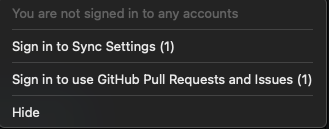
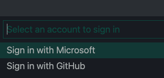
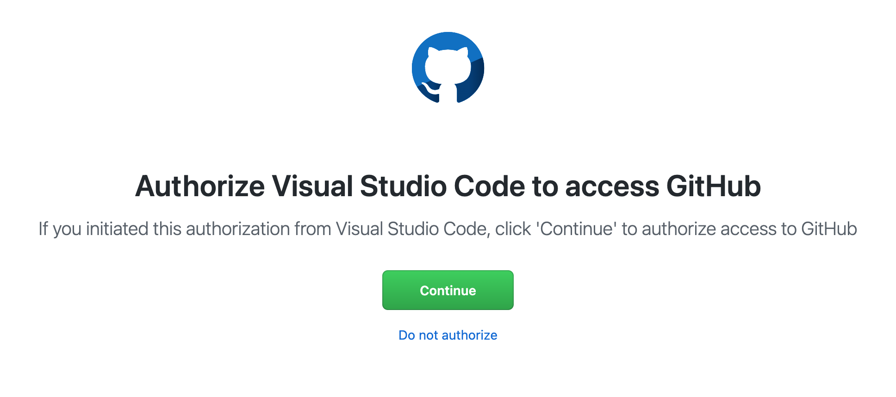
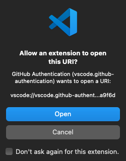
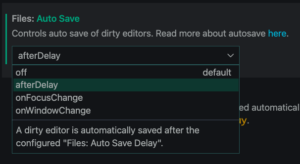
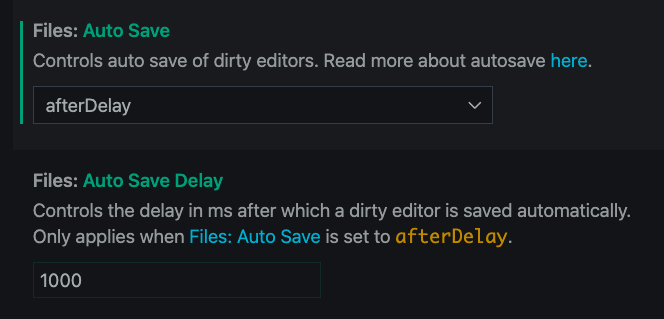

# Important VS Code Resources

> _These resources and tweaks are from former students.  Settings, extensions, and tweaks are user dependant and personal.  Find what you like!_

We will be using Visual Studio Code as our IDE (Integrated Development Environment). It is available for Mac, PC, and Linux systems.

> **Important**\
> There is a _Visual Studio_ and a _Visual Studio Code_! Make sure to have _Visual Studio Code_!

## User Interface

So I am not going to reinvent this wheel. Go read the VS Code User Interface Docs. Learn this UI. It is your new home.

## Setup

After installing VS Code, it is ready to go. However, here are a few things to help with optimize the workflow, organization, and experience.

### Command Line Launch

#### Mac Only (Windows & Linux ready out of box(mostly!))
It is handy to launch VS Code directly from the CLI (Command Line Interface) or Terminal app. Here is what to do.

1. Launch VS Code
2. Open the Command Palette (⇧⌘P)
3. Type 'shell command' to find the Shell Command: Install 'code' command in PATH command.\
   

4. Restart your Terminal App.

Now you can type "code . " or "code . (file name)" in any folder to start editing in VS Code!

### Sign-in and Sync

VS Code now has a Sync feature built in that will sync all your customizations and extensions across devices and will restore if you ever have a system failure or change. Also, if you login with GitHub, you can access and use Git directly in VS Code and use key extensions, like GitHub and LiveShare.

> **Important**\
> You need a GitHub account! It is your life now. Use it!

1. Click on the Avatar icon.\
   
2. Click on "Sign in to Sync Settings"\
   
3. A window will open at the top. Click on "Sign in and Turn on"\
   
4. Now another window will open, click on "Sign in with GitHub"\
   
5. Now a browser will open(I know, crazy, but stay with me), click on "Continue"\
   
6. Now an alert will open, click on "Open Visual Studio Code"\
    - If there is no alert or it doesn't work, use the "Didn't work" option at the bottom of the browser.\
    
7. Back to VSCode, a security window will open(OMG, Really! Thanks Black Hats!), click on "Open"\
   
8. Finally, it is connected! Celebrate!\
   

## Settings

Under the Gear icon is an important menu with several quick access items. But lets go to "Settings".

For the most part, you can leave everything at it's default settings. But from here, you can tweak VS Code. The common tweaks are listed first.

> Note: these are optional tweaks and based on personal preference.

1. Auto Save\
   You can set VS Code to auto save your work. This can be useful for live previewing and to never forget to save!
   
   You have three options:

   - afterDelay _(most common)_
     - saves your file after a set time (in ms so 1 sec is 1000. Get used to it, that is programming!)\
       Set the time in the field below the select field.\
       
   - onFocusChange
     - saves file when you move away from the tab/file you are in to something else in VS Code.
   - onWindowChange
     - saves file when you change to a different system window, like Finder.

2. Font and Size\
   We will talk more about this in Theme's in Extensions, but you can change the font size and Font type here if you like.
   

3. Tab Indention: 2 vs 4\
   Ok, this is a war that has been ragging in programming since the beginning of time, like Jedi vs Sith. (just do a Google search)
   

It is a personal preference....kinda. Python requires a 4 space tab. Lots of React & Gatsby projects use a 2 space tab, but it's not required. So, this option is here if/when you want/need to change it.\

At this point, you can dive deeper into the tweaks. Experiment if you like. Just remember what you did so you can undo it.

## Extensions

Extensions are plugins. And there are a plethora.

Here are a few that are common place and are handy. Again, most are optional, but some you will want for class.

Feel free to share what you find as we are always looking for useful extensions.

## How to install

Click on the extensions icon in VS Code and search for the Extension you want.

Or

Click on the link and install from the Visual Studio Marketplace.

### General Use & Recommended

1.  Auto Complete Tag\
    

    >This is a Pack with two extensions.  Auto Close Tag and Auto Rename Tag.  They will automatically close your tags and if you rename them, it will change the opening/closing tag automatically.

2.  Bracket Pair Colorizer 2\
    

    >Adds color to your curlies "{ }", brackets "[ ]", and parentheses "( )".  Very useful when trying to find the missing one!

3.  Code Spell Checker\
    

    > Great tool to help defend against the Spelling Nemesis!/ Look for the light blue word linter for misspelled (or what it thinks is misspelled).

4.  Indent-Rainbow\
    

    >This extension colorizes the indentation in front of your text alternating four different colors on each step.

5.  Live Share\
    

    >We will use this in class, so get it.  This will let you pair program.  It creates a secure link that you can share with another teammate and they can access your VS Code.  You must have it to access a teammate's URL Link.  Very useful.  Once installed, you will have this icon.\
    

6.  Live Server\
    

    >We will use this in class, so get it.  This lets you generate a live server from VS Code while you are working on Frontend projects.

7.  Lorem ipsum\
    

    >Just a quick little tool to add lorem ipsum sample text when needed.

8.  Visual Studio IntelliCode\
    

    >This is magic!  In simple terms, it is hints on what code you could use!

### Formatting and Themes

Themes - just search for themes. There are so many. Star Wars, Game of Thrones, Cyberpunk..... They add font colors, fonts, dark and light modes, icon packs, the works. Here are some we like.

1.  Bearded Theme\
    

    >Cool theme pack with 17 different theme variations.

2.  ENV\
    

    >Adds formatting and syntax highlighting support for env files (.env) to Visual Studio Code

3.  Material Icon Theme\
    

    >Material Design Icons for Visual Studio Code

4.  Prettier Formatter\
    

    >Prettier is an opinionated code formatter. It enforces a consistent style by parsing your code and re-printing it with its own rules that take the maximum line length into account, wrapping code when necessary.

### JavaScript & React

1.  ESLint\
    

    >ESLint is a code error checker that will save you.  Must have.

2.  ES7 React/Redux/GraphQL/React-Native\
    

    >This extension provides you JavaScript and React/Redux snippets in ES7 with Babel plugin features for VS Code.

3.  Quokka.js\
    

    >Quokka.js is a developer productivity tool for rapid JavaScript / TypeScript prototyping. Runtime values are updated and displayed in your IDE next to your code, as you type.

### Python

1.  Python Extension Pack\
    

    >This extension pack packages some of the most popular Python extensions.
    
    >Extensions Included\
            - Python - Linting, Debugging (multi-threaded, remote), Intellisense, code formatting, refactoring, unit tests, snippets, Data Science (with Jupyter), PySpark and more.\
            \
            - MagicPython - Syntax highlighter for cutting edge Python.\
            \
            - Jinja - Jinja template language support for Visual Studio Code.\
            \
            - Django - Beautiful syntax and scoped snippets for perfectionists with deadlines.\
            \
            - Visual Studio IntelliCode - Provides AI-assisted productivity features for Python developers in Visual Studio Code with insights based on understanding your code combined with machine learning..

2.  Python Indent\
    

    >Remember I talked about Python requiring a specific indent?  Well here is a sure fire fix.

### CSS

1.  IntelliSense for CSS\
    

    >The magic hint for CSS class names.

### Git & GitHub

1.  GitHub\
    

    >This extension allows you to review and manage GitHub pull requests and issues in Visual Studio Code.

2.  GitLens\
    

    >GitLens supercharges the Git capabilities built into Visual Studio Code. It helps you to visualize code authorship at a glance via Git blame annotations and code lens, seamlessly navigate and explore Git repositories, gain valuable insights via powerful comparison commands, and so much more.

##### contributors:
Ryan Schniederjan - TA\
Sam Hollyer - TA

> Message Ryan or your instructor on Slack to contribute.